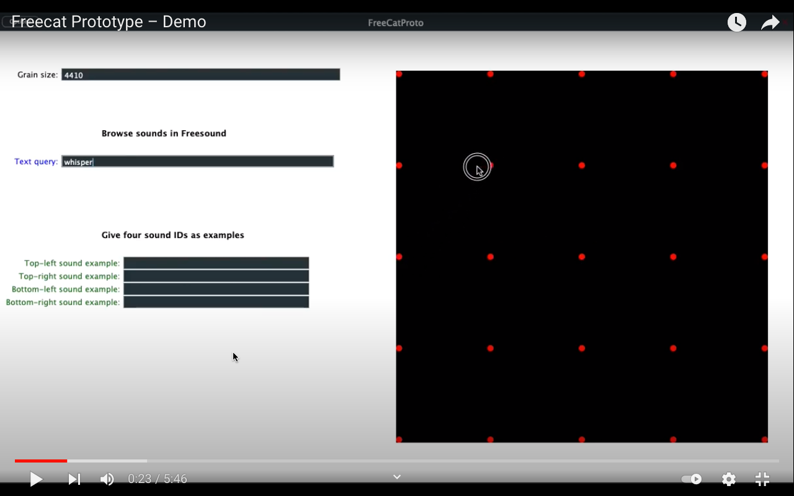

# Freecat Prototype
Author: Gonzalo Nieto Montero [@gonznm](https://github.com/gonznm)

Freecat is an instrument developed by Gonzalo Nieto Montero in the context of his master thesis [*Generating sound palettes for a Freesound concatenative synthesizer to support creativity*](https://zenodo.org/record/5554709), for the Sound and Music Computing Master at the Music Technology Group (Universitat Pompeu Fabra, Barcelona). 

Freecat is a [con*cat*enative synthesizer](https://en.wikipedia.org/wiki/Concatenative_synthesis#:~:text=Concatenative%20synthesis%20is%20a%20technique,milliseconds%20up%20to%201%20second.) connected to [*Free*sound](https://freesound.org/). It has a two-dimensional grid map on which Freesound sounds are represented and manipulated with a mouse. The map can be filled with two different search methods: a text query and a special query-by-four-examples.

[](https://youtu.be/vXJb7_HPi-M)

It can be used as an standalone application or as a plugin (VST3 and AU).

## How to run
>Tested in a macOS Mojave 10.14.6 with Docker version 20.10.5. Notice that this is a prototype and it has not been exhaustively tested with many users. It has a bug for unknown reasons that causes the application to crash with some queries and it may have other unknown bugs. Feel free to contribute!

The program is divided in two parts: a C++ (JUCE) and a python one. Python handles the interaction with the Freesound API and the feature extraction process using Essentia, while C++ handles real-time concatenation, playback and interaction. They communicate via OSC, and python part runs inside a docker container, to facilitate the installation of all dependencies and to reach the main platforms.

The python part is irrelevant to the user, it only needs to be run at the background one time at the beginning – further work could be to implement all in C++ using the [JUCE client library of the Freesound API](https://github.com/mtg/freesound-juce).

Follow these steps:

0) Install [Docker Desktop](https://www.docker.com/products/docker-desktop) in case you don't already have it.

1) Build the freecat docker image by running this command from the FreeCatPython folder (only needed the very first time, afterwards docker will reuse the built image):
```docker
docker build -t freecat .
```

2) Start the container that will be running in the background:
```docker
docker run --rm -p 0.0.0.0:9002:9002/udp -v `pwd`:/tmp freecat python3 /tmp/main.py
```

3) Standalone version: run the application `./FreeCatJUCE/Builds/MacOSX/build/Debug/Freecat.app`. Plug-in: copy the item you want to use (`Freecat.vst3` or `Freecat.component`) to its corresponding plug-ins folder on your computer, then open it in your favourite DAW.

4) Start experimenting!